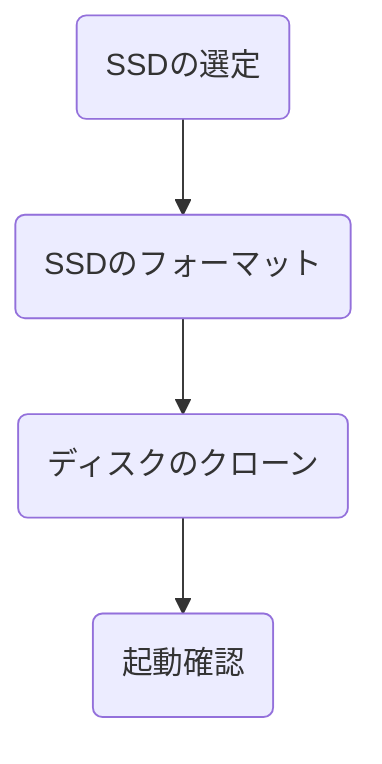

# はじめに

ディスクの空き容量が少なくなってきたので、容量の大きいSSDへOSを移行した話。

# 要約

* ディスクのクローンは MiniTool ShadowMaker Free で実施
* セクタサイズが異なるSSD同士でも移行できた

# SSDからSSDへOSを移行した

:::message alert
移行に失敗した場合、データが消失する可能性があります。事前にバックアップを取得し、自己責任でお願いします。
:::

## 前提

* PC
  * メーカ：ASUS
  * モデル：VivoMini VC65
  * OS：Windows10 64bit
  * ディスク(移行前)：SSD 128GB + HDD 500GB
  * ディスク(移行後)：SSD 500GB + HDD 500GB

## 手順

## SSDの選定

SSDって何を基準に選べばいいの？という状態だったので、イチから調べながらSSDを探す。以下の条件で探したところ、[Samsung 870 EVO](https://www.amazon.co.jp/gp/product/B08SVN8MVP/ref=ppx_yo_dt_b_asin_title_o01_s00?ie=UTF8&psc=1)がよさそう。

* 規格サイズ：2.5インチ
* インタフェース：SATA
* 容量：500GB以上

移行前後でセクタバイトが異なるとクローンに失敗するという情報があったので心配しつつも、SSDをSATAで直つなぎすればセクタバイト512でフォーマットできるようなので、ひとまず購入。

## SSDのフォーマット

HDDを取り外し、購入したSSDをとりつける。以前PCを掃除した時にHDDを取り外したことがあったのでスムーズに交換できた。

https://zenn.dev/sunazukin/articles/05d6ee9ea8e5c4

`Windowsアプリ システム情報 > コンポーネント > 記憶域 > ディスク`からセクタバイト512で認識されていることを確認。

続いてSSDをフォーマットする。詳細手順は[こちら](https://shikamori-p.com/ssd-external-enclosure-recommended/#i-4)を参照。[パーティションスタイル](https://reneeds.net/2020/08/14/mbr-gpt/#MBRGPT)は移行元SSDと同じ`GPT`を選択。

## ディスクのクローン

以前は`EaseUS Todo Backup Free`が無料で使えたようだけど、今はディスククローン機能が有料版限定になっていた。色々探したところ、[MiniTool ShadowMaker Free](https://jp.minitool.com/backup/system-backup.html)なら無料でディスククローンができるみたい。

[こちらの手順](https://shikamori-p.com/ssd-clone-free-soft/#i-4)に従ってクローンを作成。1時間くらいはかかるかな？と思ったけど、10分もかからず完了。

## 起動確認

ツールの案内に従い、クローンしたSSDのみを接続してOSが起動するか確認。BIOS設定を変更する必要もなくOSが起動。最後は取り外していたHDDを接続して移行完了。

## 参考記事

* [[2021年最新]SSDをクローンできるフリーソフトと使い方。無料でSSD換装・データ移行する方法。](https://shikamori-p.com/ssd-clone-free-soft/)
* [Windows 10 でSSDをフォーマットする目的と手順とは？](https://solution.fielding.co.jp/column/it/itcol04/202007_01/)

# おわりに

空き容量増えたし、ローカルに色々と検証環境構築しよう。
