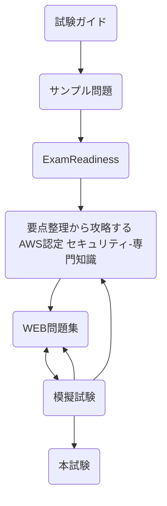

# はじめに

2021年8月12日に「AWS Certified Security - Specialty」を受験し、無事合格しました。どのように学習したかを記録に残しておきます。

:::message
あくまでも個人の学習記録なので、役に立ちそうなところを参考にしてもらればと思います
:::

# 要約

* 勉強期間は約2週間、結果は921点
* まとめノートを作って定期的に見直すと、知識が定着しやすいので⭕️
* SAPを取得していれば比較的取り組みやすい
* SAPの学習記録は[別記事参照](https://zenn.dev/sunazukin/articles/1272bb2a1f179d)

# SCS合格までにやったこと

## 前提

* AWSの業務経験は約2年
  * といっても ELB + EC2 を組み合わせたハンズオンレベルなので、業務で蓄積した知識は少なめ
* AWS認定アソシエイト3資格 + SAPを取得済み

## 使用した教材

* 参考書
  * [要点整理から攻略する『AWS認定 セキュリティ-専門知識』](https://www.amazon.co.jp/%E8%A6%81%E7%82%B9%E6%95%B4%E7%90%86%E3%81%8B%E3%82%89%E6%94%BB%E7%95%A5%E3%81%99%E3%82%8B%E3%80%8EAWS%E8%AA%8D%E5%AE%9A-%E3%82%BB%E3%82%AD%E3%83%A5%E3%83%AA%E3%83%86%E3%82%A3-%E5%B0%82%E9%96%80%E7%9F%A5%E8%AD%98%E3%80%8F-Compass-Books%E3%82%B7%E3%83%AA%E3%83%BC%E3%82%BA-NRI%E3%83%8D%E3%83%83%E3%83%88%E3%82%B3%E3%83%A0%E6%A0%AA%E5%BC%8F%E4%BC%9A%E7%A4%BE-ebook/dp/B08DCLRHC7/ref=sr_1_3?dchild=1&qid=1629022942&s=digital-text&sr=1-3&text=NRI%E3%83%8D%E3%83%83%E3%83%88%E3%82%B3%E3%83%A0%E6%A0%AA%E5%BC%8F%E4%BC%9A%E7%A4%BE)
* 問題集
  * [WEB問題集で学習しよう](https://aws.koiwaclub.com/)
* WEB
  * [試験ガイド](https://d1.awsstatic.com/ja_JP/training-and-certification/docs-security-spec/AWS-Certified-Security-Specialty_Exam-Guide.pdf)
  * [サンプル問題](https://d1.awsstatic.com/ja_JP/training-and-certification/docs-security-spec/AWS-Certified-Security-Speciality_Sample-Questions.pdf)
  * [Exam Readiness](https://www.aws.training/Details/eLearning?id=34786&ep=sec&sec=spec_security)
  * [AWS公式ドキュメント](https://docs.aws.amazon.com/index.html)
  * [よくある質問](https://aws.amazon.com/jp/faqs/?nc1=f_dr)
  * [Black Belt Online Seminar](https://aws.amazon.com/jp/aws-jp-introduction/aws-jp-webinar-service-cut/)
  * [DevelopersIO ブログ](https://dev.classmethod.jp/)

## 全体の流れ

全体の流れは以下の通りです。[^1]

フローチャートに記載していないですが、わからないことがあったら、AWS公式ドキュメント・よくある質問・Black Belt・DevelopersIO ブログを中心に調べ、Excelにまとめていました。

## スケジュール

### 初期(1~3日目)

SAPを受験したばかりでガツガツ勉強する気力がなかったので、まずはAWSの公式資料（試験ガイド・サンプル問題・Exam Readiness）に目を通しました。その後、「要点整理から攻略する『AWS認定 セキュリティ-専門知識』」の模擬試験以外の章をざっと1周読みました。

「Exam Readiness」は音声が英語なので少し敷居が高く感じていましたが、資料は日本語＋字幕ありなので、特に問題なく視聴できました。
SCSの試験範囲となるサービスについてはSAPでおおむね学習済みで、**KMS + 各サービスのデータ暗号化**については細かく見ておいた方がよいかな～という印象でした。

### 中期(4~9日目)

「WEB問題集で学習しよう」を#1から順に解きました。ところどころわからない問題がありましたが、SAPに比べると圧倒的にスムーズに進みました。

### 後期(10~14日目)

「WEB問題集で学習しよう」を1周したので模擬試験を解きました。結果は以下の通りです。

| 問題 | 正解数[^2] | 正解率 |
| ---- | :----: | :----: |
| 参考書 | 29 | 73% |
| AWS公式 | 16 | 75% |

おや、思ったより正解率が低いぞ…と少し焦り、今までやったことを一通り見直しました。
具体的には以下を実施しました。

1. まとめノート(Excel)を見直す
2. 「WEB問題集で学習しよう」を解きなおす
3. 「要点整理から攻略する『AWS認定 セキュリティ-専門知識』」を読み直す

### 試験本番

SAPよりは易しいだろうと思っていたのですが、最初の10問ぐらいは自信のある問題がなく非常に焦りました。その後も2択までは絞れるけどあとは神頼み！という問題が多々あり、不安なまま試験終了。無事合格はしたもの、若干のモヤモヤが残りました…

# おわりに

次は「AWS Certified DevOps Engineer - Professional」か「AWS Certified Database - Specialty」のどちらかを受験しようと思います。

[^1]: フローチャート書きたかっただけです
[^2]: 問題数は参考書が40問, AWS公式が20問
